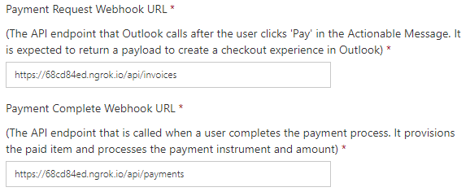

# Sample ASP.NET Web API Payments in Outlook webhook

This is an example implementation of the payment request and payment complete webhooks for a [Payments in Outlook](https://docs.microsoft.com/outlook/payments/) service.

## Prerequisites

Prior to running this sample, you must [register in the Payments in Outlook dashboard](https://docs.microsoft.com/outlook/payments/partner-dashboard) and you must have a [Stripe](https://stripe.com/connect) connect platform account.

You must also have Visual Studio 2017 installed.

## Configuring the sample

1. Make a copy of the [OutlookPayments/MerchantInfo.EXAMPLE.config](OutlookPayments/MerchantInfo.EXAMPLE.config) file in the **OutlookPayments** directory. Rename this copy of the file to `MerchantInfo.config`.
1. Open **OutlookPayments.sln** in Visual Studio.
1. Open the **MerchantInfo.config** file and update the value of the `MerchantId` key with your merchant ID from the Payments in Outlook dashboard.

## Running the sample

Press **F5** or select **Start Debugging** from the **Debug** menu in Visual Studio.

## Using ngrok to run locally

When you run the sample locally, it is accessible via `http://localhost:52663`. The Payment service must be able to contact your webhook from the internet, so running on localhost won't work. However, by using [ngrok](https://ngrok.com/), we can create a publicly accessible address that is temporarily able to contact localhost.

Open a command prompt or shell and run the following command:

```Shell
ngrok http 52663 -host-header=localhost:52663
```

The output should look similar to this:

```Shell
ngrok by @inconshreveable                                     (Ctrl+C to quit)

Session Status                online
Account                       Jason Johnston (Plan: Free)
Version                       2.2.8
Region                        United States (us)
Web Interface                 http://127.0.0.1:4040
Forwarding                    http://68cd84ed.ngrok.io -> localhost:52663
Forwarding                    https://68cd84ed.ngrok.io -> localhost:52663
```

Copy the HTTPS URL from the second `Forwarding` entry. In the above output, the URL to copy is `https://68cd84ed.ngrok.io`. Using that URL as the base, let's construct two URLs: one to the payment request webhook (ngrok URL + `/api/invoices`), and one to the payment complete webhook (ngrok URL + `/api/payments`). For example, using the URL from the example output above:

```http
https://68cd84ed.ngrok.io/api/invoices
https://68cd84ed.ngrok.io/api/payments
```

> [!IMPORTANT]
> Leave ngrok running so those URLs remain active.

Update your webhook URLs in the partner dashboard with these URLs for testing.



## Generating a test payment request message

See [Get started with Payments in Outlook](https://docs.microsoft.com/outlook/payments/get-started#send-the-test-payment-request) for steps to send a test message to yourself.

## Contributing

This project welcomes contributions and suggestions.  Most contributions require you to agree to a
Contributor License Agreement (CLA) declaring that you have the right to, and actually do, grant us
the rights to use your contribution. For details, [https://cla.microsoft.com](https://cla.microsoft.com).

When you submit a pull request, a CLA-bot will automatically determine whether you need to provide
a CLA and decorate the PR appropriately (e.g., label, comment). Simply follow the instructions
provided by the bot. You will only need to do this once across all repos using our CLA.

This project has adopted the [Microsoft Open Source Code of Conduct](https://opensource.microsoft.com/codeofconduct/).
For more information see the [Code of Conduct FAQ](https://opensource.microsoft.com/codeofconduct/faq/) or
contact [opencode@microsoft.com](mailto:opencode@microsoft.com) with any additional questions or comments.
